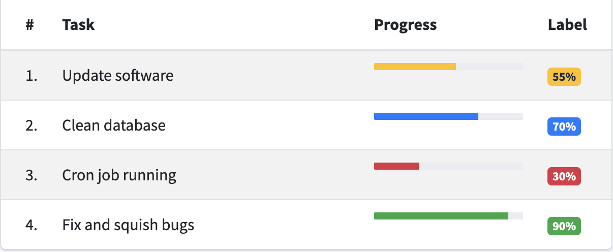

# CHALLENGE: INPUT-OUTPUT

## Ejercicio 1

Se pide implementar el listado de tareas mostrado en la tabla siguiente. Debe utilizarse para ello componentes unidades, en concreto deberán utilizarse los siguientes componentes:

* ***TableComponent***: dicho componente debe dibujar una tabla a partir de un listado de tareas. La Tarea contiene un nombre y un porcentaje de desarrollo de la misma.
* ***TaskComponent***: dicho componente dibuja el nombre de la tarea.
* ***ProgressBarComponent***: este componente recibe por parámetro @Input el porcentaje de desarrollo de la tarea y en función de este lo dibuja en un Progress bar con un color diferente en función del grado de desarrollo.
* ***LabelComponent***: el comportamiento es similar al *ProgressBarComponent* pero en lugar de dibujar una barra de progreso, utiliza un badge con el valor que recibe por @Input.

## Ejercicio 2

Sobre la tabla anterior, realizar los siguientes cambios:

1. Modificar el componente *LabelComponent* para que en lugar de mostrar un badge, muestre un `<input type="number" />` que permita modificar el valor del porcentaje. Hacer uso de ***ngModel*** para ello.
2. Cuando ese valor sea modificado, deberá trasladarse al componente *TableComponent*, para que éste se lo comunique al componente *ProgressBarComponent*.
3. Añadir al mismo nivel que el *TableComponent* un contador de tareas finalizadas VS total de tareas, haciendo uso de un nuevo componente ContadorComponent.